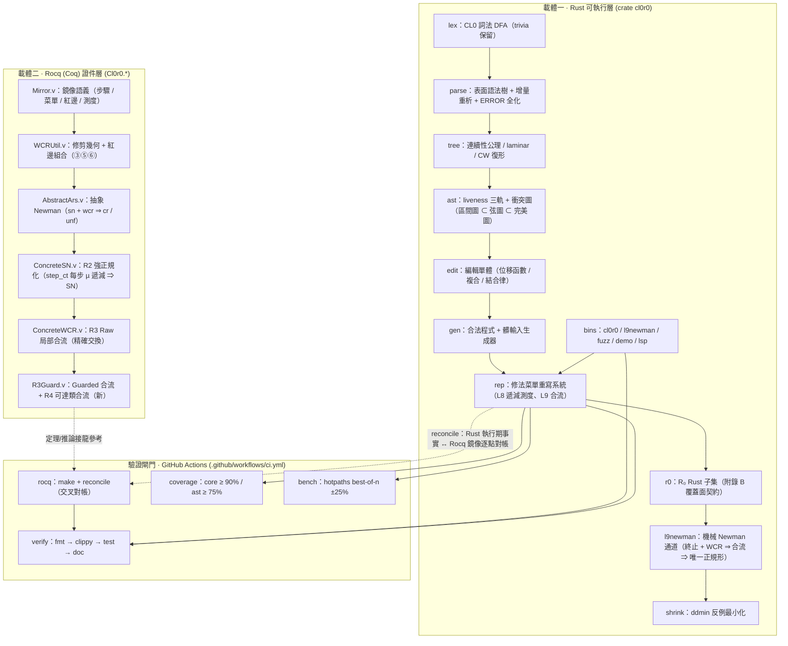

# 架構圖(Architecture Diagram)

> 使用 **Mermaid** 語法。在支援 Mermaid 的檢視器(GitHub、VS Code、Typora、Obsidian 等)中會渲染成圖;
> 在純文字/靜態預覽中顯示為原始碼。字型/繪圖引擎隨檢視器而異,結構以本檔為準。

## 1. 雙載體總覽(flowchart)

## 2. 語意分層（由上而下）

| 層 | 載體 | 責任 | 對應契約 |
|---|---|---|---|
| 語法面 | Rust `lex`→`parse`→`tree` | 表面語法樹、增量重析、連續性 | §1–§2.3 |
| 語義面 | `ast` | liveness 三軌、衝突圖（完美圖） | §3.2–3.3 |
| 變換面 | `edit`→`gen`→`rep` | 編輯單體、生成器、修法菜單 | §2.1 / §4 |
| 規約面 | `r0` | R₀ 子集覆蓋面 | 附錄 B |
| 終止/合流 | `l9newman` | Newman 通道（定理級） | §5–§6 |
| 反例工程 | `shrink` | ddmin 最小反向例 | §8 |
| 鏡像/證件 | `rocq/theories/` | 語義鏡像 + 定理，kernel 驗證 | Phase 0–3 |
| 閘門 | `ci.yml` | 可執行驗收（四道閘） | 本檔 §1 |

## 3. 為什麼用 Mermaid

* **純文字可版本化**:與 `docs/` 其他 `.md` 一樣進 `git` 可 diff,無需外部繪圖工具。
* **不依賴二進位**:任何支援 Mermaid 的檢視器即時渲染;CI 無需額外安裝。
* **語法可驗證**:可用 `npx @mermaid-js/mermaid-cli` 或 `.github/workflows/` 中的靜檢工具做「語法綠」。
