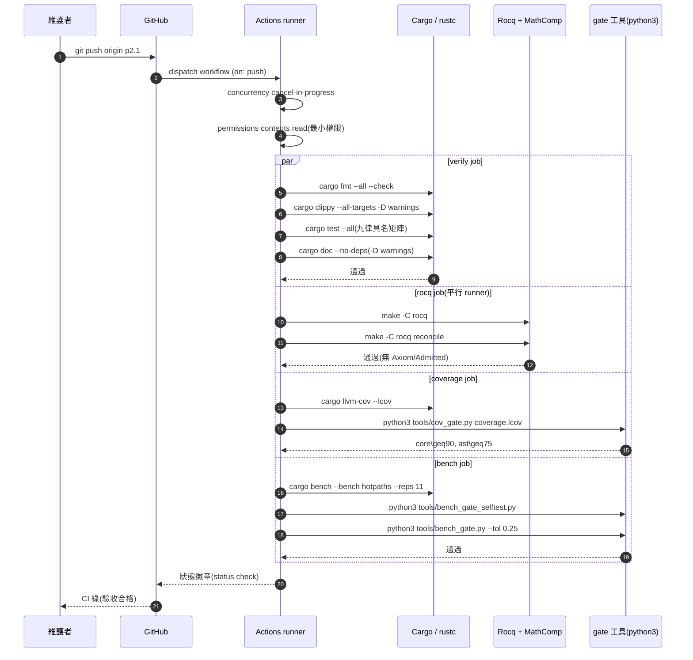
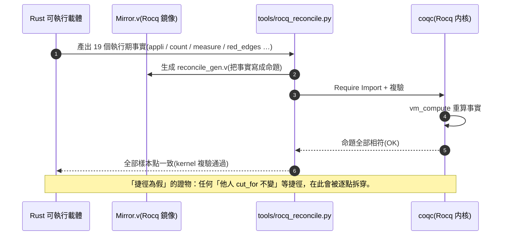

# 序列圖(Sequence Diagram)

> **Mermaid** 語法。兩個場景:
> 1. **CI 驗收管道** —— 推送 `p2.1` 後 GitHub Actions 依序執行四道閘門。
> 2. **交叉對帳(自我驗證)** —— `tools/rocq_reconcile.py` 把 Rust 執行期事實與 Rocq 鏡像逐點對照。
>
> 已用 `npx @mermaid-js/mermaid-cli` 渲染驗證(語法綠)。

## 1. CI 驗收管道(推送 p2.1)

> 註:`par / and` 表示四道閘在**各自的 runner 平行執行**(`runs-on` 各自獨立);
> 任一閘紅 → 整體失敗,即「驗收不合格」。

## 2. 交叉對帳(自我驗證;reconcile)

> 對應 `make -C rocq reconcile` ⇒ `tools/rocq_reconcile.py`。
> 對帳的 19 個「Rust 事實」直接在 Rust 側具名測試重算,再由 Rocq `vm_compute` 複驗 `=`。

## 3. 附註

* 兩個圖都屬**同步/依序**描述;`par / and` 僅反映 CI 的 job 平行。
* 若要驗證 Mermaid 語法,本地跑 `npx @mermaid-js/mermaid-cli -i <檔>.mmd -o out.png`(需系統 `libnss3 libnspr4` 等,見 `docs/ARCHITECTURE.md` §3)。
